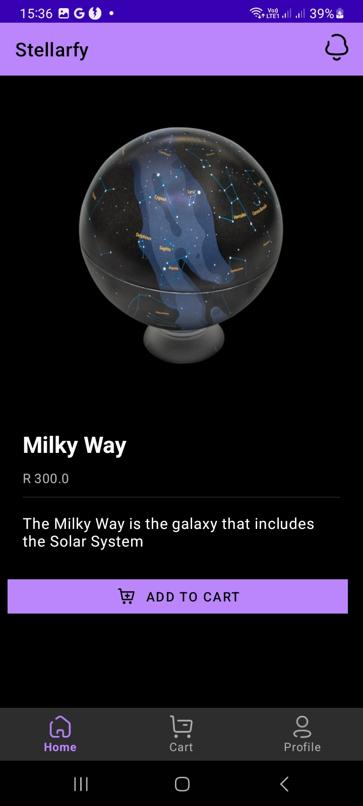

# stellarfy
Stellarfy is an android application created using Java where you can buy globes ,whether its planetery or galactic .

# Technology used
1. Android studio/Java
2. Ngrok - For connection with the local api
3. Picasso - For image management
4. Material 1.9.0 - for the UI
5. Retrofit2 - For connecting with APIs

***
Snapshots

1. ## **You must login to use the app**
    - 
1. ## **View the catalog**
    - 
1. ## **You can view the items individually**
    - 
1. ## **You can view the cart**
    - 